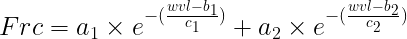

# **Introduction**

This data consist... 
in  a similar way of the following [repository](https://github.com/lm-costa/draft_bepe) we are gonna retrieved some metrics for the partial and clear sky days together. This table are already pre-proceed. 

```{r,echo=TRUE, warning=FALSE,cache=FALSE,message=FALSE}
nfile <- list.files("data-raw/", pattern = "_psd")
psd_table <- readr::read_rds(paste0("data-raw/",nfile))

```

## **Cleanning the data**

### Excluding criteria
i) n <= 6 in a day
ii) based on histogram & density distribuition + scatter plot of L750

```{r,echo=TRUE, warning=FALSE,cache=FALSE,message=FALSE}
psd_table |>
  ggplot2::ggplot(ggplot2::aes(x=DOYdayfrac, y=Incoming750_Wm2nm1sr1))+
  ggplot2::geom_jitter()+
  ggplot2::geom_smooth()+
  ggplot2::facet_wrap(~DOYdayfrac%/%1,scales = "free")

```

```{r,echo=TRUE, warning=FALSE,cache=FALSE,message=FALSE}
psd_table |>
  ggplot2::ggplot(ggplot2::aes(x =Incoming750_Wm2nm1sr1))+
  ggplot2::geom_histogram(bins = 5)+
  ggplot2::geom_density(col="red")+
  ggplot2::facet_wrap(~DOYdayfrac%/%1, scales = "free")
```
```{r,echo=TRUE, warning=FALSE,cache=FALSE,message=FALSE}
psd_table <- psd_table |>
  dplyr::filter(
    day != 144 & day!=151  & day!= 156 & day!=158 & day!=166
    & day!=168 & day!=192  # criteria i
    & day!= 147 & day != 148 & day!=149  & day!=157 & day!=163
    & day!=172 & day!=175 & day!=176 & day!=179 & day!=184 & day!=189
    & day!=193 & day!= 199 & day!=200 & day!=201
  )
```

## **Integrating by wavelength and Correlating the wavelength with GPP**

```{r,echo=TRUE, warning=FALSE,cache=FALSE,message=FALSE}
spect_tab <- psd_table[,-c(1:85,768:943)]
spect_tab <- as.data.frame(t(spect_tab))

c_spec <- as.character(psd_table$Group.1)
colnames(spect_tab) <- c_spec
spect <- names(psd_table)[86:767]
spect_tab <- cbind(spect,spect_tab)

integral <- function(x,y){
  approxfun(x,y)
}

result <- vector("list", length = ncol(spect_tab))

for (i in 2:(ncol(spect_tab))){
  int <- integral(spect_tab$spect, spect_tab[,i])
  result[[i]] <- integrate(int, as.numeric(min(spect_tab$spect)),
                           as.numeric(max(spect_tab$spect)))
}

for(i in 2:length(result)){
  if(i==2){
    fint <- result[[i]]$value
  }else{
    fint_a <- result[[i]]$value
    fint <- rbind(fint,fint_a)
    fint <- as.data.frame(fint)
  }
}

row.names(fint) <- seq(1:(nrow(fint)))
colnames(fint) <- "Fint"

## Now we are gonna add the integral in the final dataset

psd_table <- cbind(psd_table,fint)

######
fint_t <- vector("numeric", length = ncol(spect_tab))

fint_t[2:ncol(spect_tab)] <- t(fint)

spect_tab[683, ] <- fint_t

gpp <- vector("numeric", length = ncol(spect_tab))
gpp[2:ncol(spect_tab)] <- psd_table$GPP_DT_U95
spect_tab[684, ] <- gpp

for(i in 2:ncol(spect_tab)){
  if(i==2){
    tab2 <- as.numeric(spect_tab[,i])
  }else{
    tab2_a <- as.numeric(spect_tab[,i])
    tab2 <- cbind(tab2,tab2_a)
  }
}
tab2 <- data.frame(tab2)
colnames(tab2) <- psd_table$Group.1
tab2 <- data.frame(t(tab2))
colnames(tab2) <- spect_tab$spect
colnames(tab2)[683] <- "fint"
colnames(tab2)[684] <- "gpp"

##
pear_resul <- vector("list", length = ncol(tab2))
for(i in 1:length(pear_resul)){
  pear_resul[[i]] <- cor.test(tab2$gpp, tab2[,i])
}

for(i in 1:length(pear_resul)){
  if(i==1){
    correl <- pear_resul[[i]]$estimate
  }else{
    correl_a <- pear_resul[[i]]$estimate
    correl <- rbind(correl,correl_a)
    correl <- as.data.frame(correl)
  }
}

rownames(correl) <- colnames(tab2)
correl[,2] <- spect_tab$spect

correl[-c(683:684),] |>
  ggplot2::ggplot(ggplot2::aes(x=as.numeric(V2), y = cor))+
  ggplot2::geom_point()+
  ggplot2::xlab(label="Fluorescence Spectra in nm")+
  ggplot2::ylab(label="Pearson's Correlation")+
  ggplot2::theme_classic()

```

## **aPAR, LUE and Fy** 


```{r}
psd_table <- psd_table |>
  dplyr::mutate(
    NIR = NDVI*Rnir,
    k1=584*sin(circular::rad(SZA)) - 88,
    k2= 3.55424 - 1.15937*cos(circular::rad(SZA)),
    aPAR= k1*sin(k2*NIR),
    Fy= Fint/aPAR,
    LUE=GPP_DT_U95/aPAR
  )

```

and finally subseting

```{r}

psd_table <- psd_table |> 
  dplyr::select(
    Group.1, day, Hr1, SZA, PAR_Wm2, NDVI, LUE, GPP_DT, GPP_DT_U95, Fy, Fint,
    `685.09`,`705.1`,`779.96` ,`740.02`,`757.11`, `771.06`
  ) |> 
  dplyr::glimpse()
```


## *Uploading clear sky days.*

This table where acquire in the following [repository](https://github.com/lm-costa/draft_bepe)

```{r, ,echo=TRUE, warning=FALSE,cache=FALSE,message=FALSE}

csd_table <- readr::read_rds("data-raw/base_csd.rds")

```


# **Regressions**
## **Clear vs Partial+Clear**

### *F integral*

```{r, ,echo=TRUE, warning=FALSE,cache=FALSE,message=FALSE}
csd_table |> 
  ggplot2::ggplot(ggplot2::aes(x=Fint,y=GPP_DT_U95))+
  ggplot2::geom_jitter(ggplot2::aes(colour=as.factor(day)))+
  ggplot2::geom_smooth(method = "lm")+
  ggpubr::stat_regline_equation(ggplot2::aes(
  label =  paste(..eq.label.., ..rr.label.., sep = "*plain(\",\")~~")))+
  ggplot2::labs(colour="DOY", x =expression(paste("F" [integral]," ( ",Wm^-2, sr^-1,mu,m^-1,")")), y= "GPP")+
  ggplot2::theme_bw()
```


```{r, ,echo=TRUE, warning=FALSE,cache=FALSE,message=FALSE}
psd_table |> dplyr::mutate(
    Period = dplyr::case_when(
      day <= 161 ~ "A",
      day <= 179 ~ "Harvest",
      day <= 193 ~ "B"
    )
  ) |>
  dplyr::filter(Period == "A" | Period == "B") |>
  ggplot2::ggplot(ggplot2::aes(x=Fint,y=GPP_DT_U95))+
  ggplot2::geom_jitter(ggplot2::aes(colour=as.factor(day)))+
  ggplot2::geom_smooth(method = "lm")+
  ggpubr::stat_regline_equation(ggplot2::aes(
  label =  paste(..eq.label.., ..rr.label.., sep = "*plain(\",\")~~")))+
  ggplot2::labs(colour="DOY", x =expression(paste("F" [integral]," ( ",Wm^-2, sr^-1,mu,m^-1,")")), y= "GPP")+
  ggplot2::theme_bw()

```

### *F 685*
```{r, ,echo=TRUE, warning=FALSE,cache=FALSE,message=FALSE}
csd_table |> 
  ggplot2::ggplot(ggplot2::aes(y=GPP_DT_U95, x= `685.09`))+
  ggplot2::geom_jitter(ggplot2::aes(colour=as.factor(day)))+
  ggplot2::geom_smooth(method = "lm")+
  ggpubr::stat_regline_equation(ggplot2::aes(
  label =  paste(..eq.label.., ..rr.label.., sep = "*plain(\",\")~~")))+
  ggplot2::labs(colour="DOY", x =expression(paste("F"[red]," ( ",Wm^-2, sr^-1,mu,m^-1,")")), y= "GPP")+
  ggplot2::theme_bw()

```


```{r, ,echo=TRUE, warning=FALSE,cache=FALSE,message=FALSE}
psd_table |> 
  dplyr::mutate(
    Period = dplyr::case_when(
      day <= 161 ~ "A",
      day <= 179 ~ "Harvest",
      day <= 193 ~ "B"
    )
  ) |>
  dplyr::filter(Period == "A" | Period == "B") |>
  ggplot2::ggplot(ggplot2::aes(y=GPP_DT_U95, x= `685.09`))+
  ggplot2::geom_jitter(ggplot2::aes(colour=as.factor(day)))+
  ggplot2::geom_smooth(method = "lm")+
  ggpubr::stat_regline_equation(ggplot2::aes(
  label =  paste(..eq.label.., ..rr.label.., sep = "*plain(\",\")~~")))+
  ggplot2::labs(colour="DOY", x =expression(paste("F"[red]," ( ",Wm^-2, sr^-1,mu,m^-1,")")), y= "GPP")+
  ggplot2::theme_bw()

```


### *F 740*
```{r, echo=TRUE, warning=FALSE,cache=FALSE,message=FALSE}
csd_table |> 
  ggplot2::ggplot(ggplot2::aes(y=GPP_DT_U95, x= `740.02`))+
  ggplot2::geom_jitter(ggplot2::aes(colour=as.factor(day)))+
  ggplot2::geom_smooth(method = "lm")+
  ggpubr::stat_regline_equation(ggplot2::aes(
  label =  paste(..eq.label.., ..rr.label.., sep = "*plain(\",\")~~")))+
  ggplot2::labs(colour="DOY", x =expression(paste("F"[Far]," "[Red]," ( ",Wm^-2, sr^-1,mu,m^-1,")")), y= "GPP")+
  ggplot2::theme_bw()

```


```{r,echo=TRUE, warning=FALSE,cache=FALSE,message=FALSE}
psd_table |>
  dplyr::mutate(
    Period = dplyr::case_when(
      day <= 161 ~ "A",
      day <= 179 ~ "Harvest",
      day <= 193 ~ "B"
    )
  ) |>
  dplyr::filter(Period == "A" | Period == "B") |>
  ggplot2::ggplot(ggplot2::aes(y=GPP_DT_U95, x= `740.02`))+
  ggplot2::geom_jitter(ggplot2::aes(colour=as.factor(day)))+
  ggplot2::geom_smooth(method = "lm")+
  ggpubr::stat_regline_equation(ggplot2::aes(
  label =  paste(..eq.label.., ..rr.label.., sep = "*plain(\",\")~~")))+
  ggplot2::labs(colour="DOY", x =expression(paste("F"[Far]," "[Red]," ( ",Wm^-2, sr^-1,mu,m^-1,")")), y= "GPP")+
  ggplot2::theme_bw()

```


When we consider the partial + clear days, we also have to consider two period, pre-harvest and after

```{r,echo=TRUE, warning=FALSE,cache=FALSE,message=FALSE}
psd_table|>
  dplyr::mutate(
    Period = dplyr::case_when(
      day <= 161 ~ "A",
      day <= 179 ~ "Harvest",
      day <= 193 ~ "B"
    )
  ) |>
  dplyr::filter(Period == "A" | Period == "B") |>
  ggplot2::ggplot(ggplot2::aes(x=Fint, y=GPP_DT_U95, col=Period))+
  ggplot2::geom_jitter()+
  ggplot2::geom_smooth(method = "lm")+
  ggpubr::stat_regline_equation(ggplot2::aes(
  label =  paste(..eq.label.., ..rr.label.., sep = "*plain(\",\")~~")))+
  ggplot2::labs( x =expression(paste("F"[integral]," ( ",Wm^-2, sr^-1,mu,m^-1,")")), y= "GPP")+
  ggplot2::theme_bw()
```


## *LUE vs Fy*
```{r,echo=TRUE, warning=FALSE,cache=FALSE,message=FALSE}
csd_table |> 
  ggplot2::ggplot(ggplot2::aes(y=Fy, x= LUE))+
  ggplot2::geom_jitter(ggplot2::aes(colour=as.factor(day)))+
  ggplot2::geom_smooth(method = "lm")+
  ggpubr::stat_regline_equation(ggplot2::aes(
  label =  paste(..eq.label.., ..rr.label.., sep = "*plain(\",\")~~")))+
  ggplot2::labs(colour="DOY", y =expression('F'[yield]), x= "LUE")+
  ggplot2::theme_bw()

```


```{r,echo=TRUE, warning=FALSE,cache=FALSE,message=FALSE}
psd_table |> 
    dplyr::mutate(
    Period = dplyr::case_when(
      day <= 161 ~ "A",
      day <= 179 ~ "Harvest",
      day <= 193 ~ "B"
    )
  ) |>
  dplyr::filter(Period == "A" | Period == "B") |>
  dplyr::filter(LUE > 0) |>
  ggplot2::ggplot(ggplot2::aes(y=Fy, x= LUE))+
  ggplot2::geom_jitter(ggplot2::aes(colour=as.factor(day)))+
  ggplot2::geom_smooth(method = "lm")+
  ggpubr::stat_regline_equation(ggplot2::aes(
  label =  paste(..eq.label.., ..rr.label.., sep = "*plain(\",\")~~")))+
  ggplot2::labs(colour="DOY", y =expression('F'[yield]), x= "LUE")+
   ggplot2::xlim(0,.5)+
  ggplot2::ylim(0,3)+
  ggplot2::theme_bw()

```

# **Correcting Fluorescence by the re-absortion**

The method for correting Fluorescence by re-absortion *(Frc)* described in *Cesana (2021)* thesis.

```{r echo=FALSE, fig.cap="",fig.align='center', out.width="500px"}



```

The two data-set are gonna be recorrected, just with the **clear sky days** and the same will be donne in the **partial + clear sky days**

```{r, echo=TRUE, warning=FALSE,cache=FALSE,message=FALSE}
fobs_file <- list.files("data-raw/",pattern = "_F_")
fobs <- readr::read_rds(paste0("data-raw/", fobs_file))

ind_file <- readr::read_csv("data-raw/table_all_index.csv") |>
  dplyr::filter(DOYdayfrac > 127.8)

fobs <- cbind(ind_file,fobs)
```


```{r, echo=FALSE, warning=FALSE,cache=FALSE,message=FALSE}
a = dplyr::case_when(
  abs(cos(circular::rad(fobs$SZA))) <=cos(circular::rad(22))~ 81.36 - 13.45*cos(circular::rad(fobs$SZA)),
  abs(cos(circular::rad(fobs$SZA))) <=cos(circular::rad(24)) ~ 78.61 -10.49*cos(circular::rad(fobs$SZA)),
  abs(cos(circular::rad(fobs$SZA))) <=cos(circular::rad(26)) ~ 77.05 -8.78*cos(circular::rad(fobs$SZA)),
  abs(cos(circular::rad(fobs$SZA))) <=cos(circular::rad(28)) ~ 77 -8.727*cos(circular::rad(fobs$SZA)),
  abs(cos(circular::rad(fobs$SZA))) <=cos(circular::rad(30)) ~ 75.157 -6.637*cos(circular::rad(fobs$SZA)),
  abs(cos(circular::rad(fobs$SZA))) <=cos(circular::rad(32)) ~ 73.526 -4.753*cos(circular::rad(fobs$SZA)),
  abs(cos(circular::rad(fobs$SZA))) <=cos(circular::rad(34)) ~ 72.087 -3.057*cos(circular::rad(fobs$SZA)),
  abs(cos(circular::rad(fobs$SZA))) <=cos(circular::rad(36)) ~ 70.665 -1.342*cos(circular::rad(fobs$SZA)),
  abs(cos(circular::rad(fobs$SZA))) <=cos(circular::rad(38)) ~ 68.9615 +0.7643*cos(circular::rad(fobs$SZA)),
  abs(cos(circular::rad(fobs$SZA))) <=cos(circular::rad(40)) ~ 67.24 +2.949*cos(circular::rad(fobs$SZA)),
  abs(cos(circular::rad(fobs$SZA))) <=cos(circular::rad(42)) ~ 65.552 +5.152*cos(circular::rad(fobs$SZA)),
  abs(cos(circular::rad(fobs$SZA))) <=cos(circular::rad(44)) ~ 63.412 +8.033*cos(circular::rad(fobs$SZA)),
  abs(cos(circular::rad(fobs$SZA))) <=cos(circular::rad(46)) ~ 61.39 +10.84*cos(circular::rad(fobs$SZA)),
  abs(cos(circular::rad(fobs$SZA))) > cos(circular::rad(46)) ~ 59.58 +13.45*cos(circular::rad(fobs$SZA)),
)

b = -0.23*cos(circular::rad(fobs$SZA))^2 + 0.58*cos(circular::rad(fobs$SZA)) + 0.43


a1 = a*fobs$`760.047500715471`^b
a2 = 0.2546*a1
b1 = 682.2
b2=706.7
c1=11.49
c2=54.47
```

doing the re-absortion

```{r,echo=TRUE, warning=FALSE,cache=FALSE,message=FALSE}
names(fobs)[c(7:688)] <- round(as.numeric(names(fobs)[(7:688)]),2)


for(i in 7:688){
  if(i==7){
    Frc <- a1*exp(-(((as.numeric(names(fobs[i]))-b1)/c1)^2)) + a2*exp(-(((as.numeric(names(fobs[i]))-b2)/c2)^2))
  }else{
    frc <- a1*exp(-(((as.numeric(names(fobs[i]))-b1)/c1)^2)) + a2*exp(-(((as.numeric(names(fobs[i]))-b2)/c2)^2))
    Frc <- cbind(Frc, frc)
  }
}

Frc <- data.frame(Frc)
names(Frc) <- round(as.numeric(names(fobs)[(7:688)]),2)

Frc <- cbind(fobs$DOYdayfrac, fobs$UTC_datetime, Frc)
names(Frc)[c(1,2)] <- c("DOY", "UTC")

```

Now we are gonna agreggate the table and compare to the gpp file . The description can be found in [here](https://github.com/lm-costa/draft_bepe)

```{r,echo=TRUE, warning=FALSE,cache=FALSE,message=FALSE}
time_table <- Frc |>
  dplyr::filter(DOY >= 144 & DOY <=193) |> 
  dplyr::filter(lubridate::hour(UTC) > 8)

min_int<-"30 min" 
sttime <- time_table$UTC[1] 
endtime <- time_table$UTC[8344]

timetoagg<-seq.POSIXt(from = as.POSIXct(sttime,tz = "UTC"),
                      to = as.POSIXct(endtime,tz = "UTC"),
                      by = min_int)

time_agg <- aggregate(x = time_table,
                      by = list(cut(as.POSIXct(time_table$UTC,tz = "UTC"),
                                    timetoagg)), FUN = mean)

gppFile <- list.files("data-raw/", pattern = "aa_")
gpp_table <- readr::read_csv(paste0("data-raw/", gppFile))


time_agg <- time_agg |> dplyr::mutate(day = time_agg$DOY%/%1,
                                      Hr1 = lubridate::hour(as.character(Group.1)),
                                      Mn1 = lubridate::minute(as.character(Group.1)))

time_agg <- time_agg[,-2]

gpp_table <- gpp_table |> dplyr::mutate(day=DOY%/%1)

comp_f_gpp <- dplyr::semi_join(time_agg,gpp_table)
comp_gpp_f <- dplyr::semi_join(gpp_table,time_agg)
comp_gpp_f <- comp_gpp_f[,-c(6,7,176)]

df_final <- cbind(comp_f_gpp,comp_gpp_f)
df_final <- df_final[-c(65,160),]

readr::write_rds(df_final,"data/Frc_csd.rds")
```

From here you can made the same procedure with the table for the all *Partial+clear Sdays* with a fill changes. The dataset can be found in `data/Frc_psd.rds`. Also the `df_final` table presented in here is availaible in `data/Frc_csd.rds`


```{r,echo=TRUE, warning=FALSE,cache=FALSE,message=FALSE}
spectra_Table <- df_final[,-c(685:860)]
spectra_Table <- as.data.frame(t(spectra_Table))
c_spectra <- paste0(lubridate::hour(as.character(spectra_Table[1,])),":",
                    lubridate::minute(as.character(spectra_Table[1, ])))
colnames(spectra_Table) <- c_spectra
spectra_Table <- spectra_Table[-c(1:2), ]
rownames(spectra_Table) <- seq(1:682)
spectra <- names(Frc)[3:684]
spectra_Table <- cbind(spectra,spectra_Table)
colnames(spectra_Table) <- make.unique(names(spectra_Table))
spectra_Table[,1] <-as.numeric(spectra_Table[,1])
spectra_Table <- spectra_Table[,-c(65,159)] # contain NA values

# spectra_Table <- spectra_Table[,-c(66,509,510)], this line of code is for the partial + clear
```

And now we can made the integral and correlation for this data again 

```{r,echo=TRUE, warning=FALSE,cache=FALSE,message=FALSE}
result <- vector("list", length = ncol(spectra_Table))

for (i in 1:(ncol(spectra_Table))){
  int <- integral(spectra_Table$spectra, spectra_Table[,i])
  result[[i]] <- integrate(int, min(spectra_Table$spectra),
                           max(spectra_Table$spectra))
}

for(i in 1:length(result)){
  if(i==1){
    fint <- result[[i]]$value
  }else{
    fint_a <- result[[i]]$value
    fint <- rbind(fint,fint_a)
    fint <- as.data.frame(fint)
  }
}

row.names(fint) <- seq(1:204)
fint <- as.data.frame(fint[-1,])
colnames(fint) <- "Fint"

df_final <- df_final[-c(65,159),]
df_final <- cbind(df_final,fint)


fint_t <- vector("numeric", length = 205)
fint_t[2:205] <- t(fint)

spectra_Table[683, ] <- fint_t
gpp <- vector("numeric", length = 205)
gpp[2:205] <- df_final$GPP_DT_U95
spectra_Table[684, ] <- gpp

for(i in 2:ncol(spectra_Table)){
  if(i==2){
    tab <- as.numeric(spectra_Table[,i])
  }else{
    tab_a <- as.numeric(spectra_Table[,i])
    tab <- cbind(tab,tab_a)
  }
}
tab <- as.data.frame(tab)
colnames(tab) <- df_final$UTC
tab <- as.data.frame(t(tab))
colnames(tab) <- spectra_Table$spectra
colnames(tab)[683] <- "fint"
colnames(tab)[684] <- "gpp"

##

pear_resul <- vector("list", length = ncol(tab))
for(i in 1:length(pear_resul)){
  pear_resul[[i]] <- cor.test(tab$gpp, tab[,i])
}

for(i in 1:length(pear_resul)){
  if(i==1){
    correl <- pear_resul[[i]]$estimate
  }else{
    correl_a <- pear_resul[[i]]$estimate
    correl <- rbind(correl,correl_a)
    correl <- as.data.frame(correl)
  }
}

rownames(correl) <- colnames(tab)
correl[,2] <- spectra_Table$spectra

```

And here we can made some plots to see how our data is now

```{r,echo=TRUE, warning=FALSE,cache=FALSE,message=FALSE}
correl[-c(683:684),] |>
  ggplot2::ggplot(ggplot2::aes(x=as.numeric(V2), y = cor))+
  ggplot2::geom_point()+
  ggplot2::labs(x="Fluorescence Spectra in nm", y="Pearson's Correlation")+
  ggplot2::theme_classic()

```

```{r,echo=TRUE, warning=FALSE,cache=FALSE,message=FALSE}
time_agg |>
  tidyr::pivot_longer(
    cols = "669.98":"779.96",
    names_to = "wavelength",
    values_to = "Fluorescence") |>
  ggplot2::ggplot(ggplot2::aes(x=as.numeric(wavelength), y=Fluorescence, color=UTC)) +
  ggplot2::geom_point() +
  ggplot2::geom_line()+
  ggplot2::facet_wrap(~day)+
  ggplot2::xlab(label="Wavelength")

```

Filtering for the same days before reabsorpion and calculating LUE an Fy

```{r}
df_tab <- df_final|>
  dplyr::filter(day != 171 & day !=177 & day !=188 & day != 189
                & day !=199 & day != 200 & day != 201)

df_tab |> 
  dplyr::mutate(
    Frc_y= Fint/csd_table$aPAR,
    Fy = csd_table$Fy) |> 
  ggplot2::ggplot(ggplot2::aes(x=Fy, y=Frc_y))+
  ggplot2::geom_jitter(ggplot2::aes(col=as.factor(day)))+
  ggplot2::geom_smooth(method = "lm")+
  ggpubr::stat_regline_equation(ggplot2::aes(
    label =  paste(..eq.label.., ..rr.label.., sep = "*plain(\",\")~~")))+
  ggplot2::labs(colour="DOY",x=expression(paste("F"[yield]," Observed")), y=expression(paste("F"[yield]," Corrected")))+
  ggplot2::theme_bw()


```

```{r}
df_tab |> 
  dplyr::mutate(
    Frc_y= `685.09`/csd_table$aPAR,
    Fy = csd_table$Fy) |> 
  ggplot2::ggplot(ggplot2::aes(x=Fy, y=Frc_y))+
  ggplot2::geom_jitter(ggplot2::aes(col=as.factor(day)))+
  ggplot2::geom_smooth(method = "lm")+
  ggpubr::stat_regline_equation(ggplot2::aes(
    label =  paste(..eq.label.., ..rr.label.., sep = "*plain(\",\")~~")))+
  ggplot2::labs(colour="DOY",x=expression(paste("F"[yield]," Observed")), y=expression(paste("F 685"[yield]," Corrected")))+
  ggplot2::theme_bw()

```


```{r}
df_tab |> 
  dplyr::mutate(
    Frc_y= Fint/csd_table$aPAR,
    Fy = csd_table$LUE) |> 
  ggplot2::ggplot(ggplot2::aes(x=Fy, y=Frc_y))+
  ggplot2::geom_jitter(ggplot2::aes(col=as.factor(day)))+
  ggplot2::geom_smooth(method = "lm")+
  ggpubr::stat_regline_equation(ggplot2::aes(
    label =  paste(..eq.label.., ..rr.label.., sep = "*plain(\",\")~~")))+
  ggplot2::labs(colour="DOY",x="LUE", y=expression(paste("F"[yield]," Corrected")))+
  ggplot2::theme_bw()

```

```{r,echo=TRUE, warning=FALSE,cache=FALSE,message=FALSE}
df_tab|>
  ggplot2::ggplot(ggplot2::aes(x=GPP_DT_U95, y= `685.09`))+
  ggplot2::geom_jitter(ggplot2::aes(colour=as.factor(day)))+
  ggplot2::geom_smooth(method = "lm")+
  ggpubr::stat_regline_equation(ggplot2::aes(
    label =  paste(..eq.label.., ..rr.label.., sep = "*plain(\",\")~~")))+
  ggplot2::labs(colour="DOY", x="GPP", y=expression(paste("F"[685]," Corrected")))+
  ggplot2::theme_bw()

```
