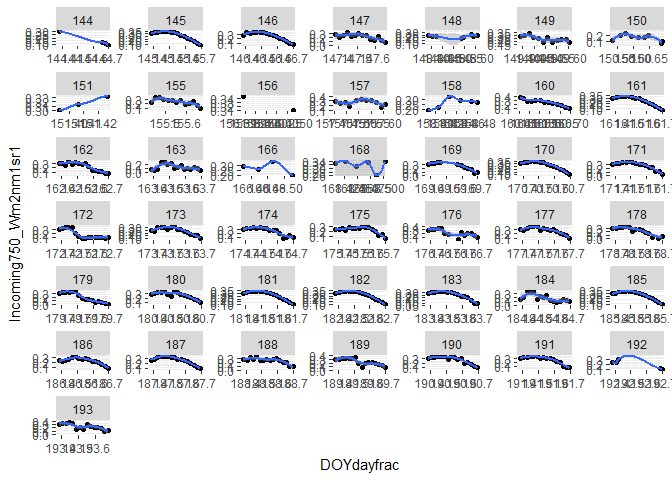
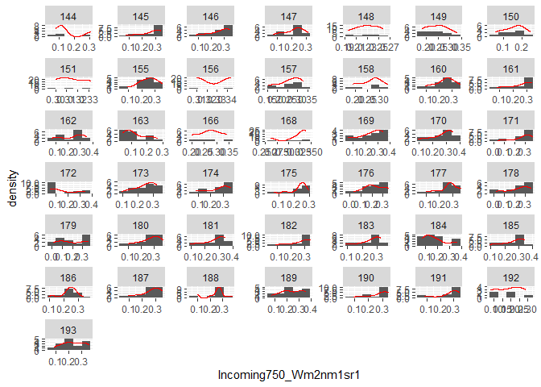
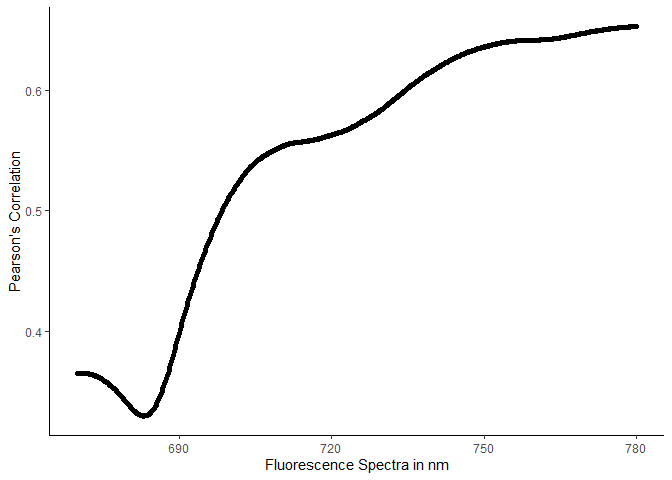
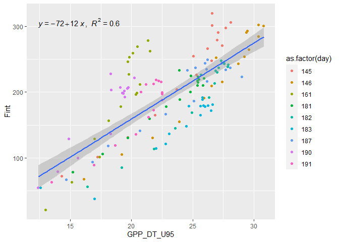
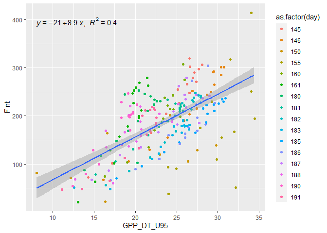
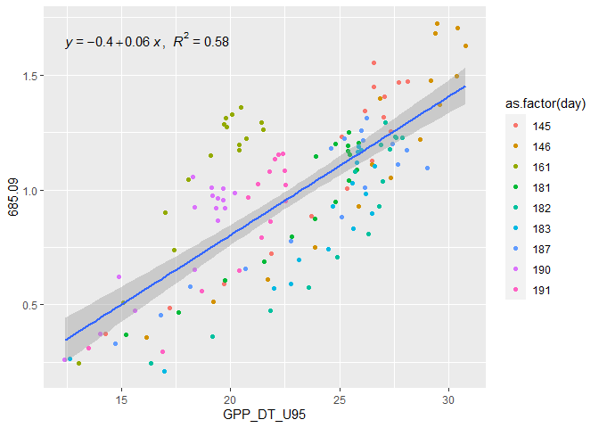
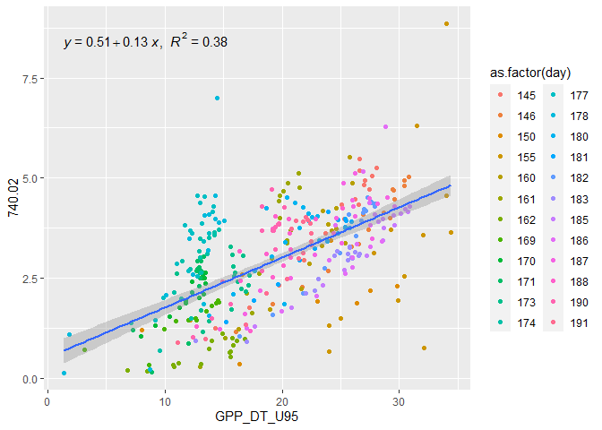
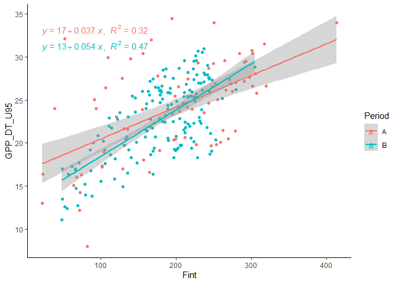
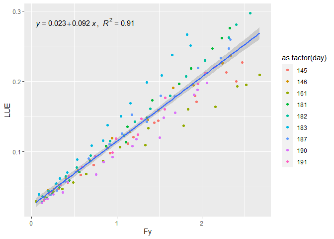
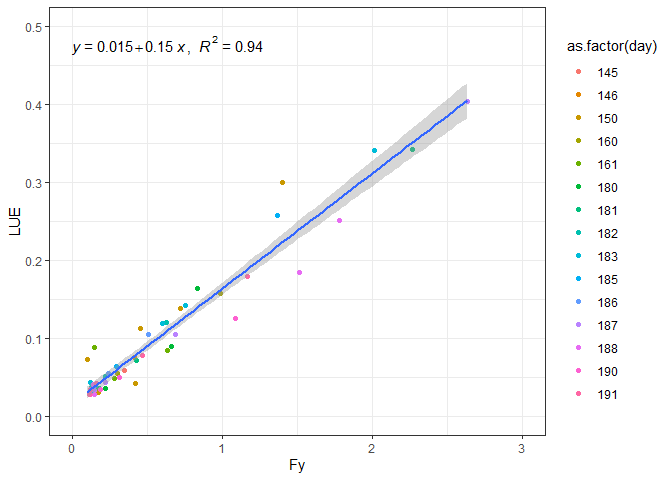

Fluorescence
================

# **Introduction**

This data consist… in a similar way of the following
[repository](https://github.com/lm-costa/draft_bepe) we are gonna
retrieved some metrics for the partial and clear sky days together. This
table are already pre-proceed.

``` r
nfile <- list.files("data-raw/", pattern = "_psd")
psd_table <- readr::read_rds(paste0("data-raw/",nfile))
```

## **Cleanning the data**

### Excluding criteria

1.  n &lt;= 6 in a day
2.  based on histogram & density distribuition + scatter plot of L750

``` r
psd_table |>
  ggplot2::ggplot(ggplot2::aes(x=DOYdayfrac, y=Incoming750_Wm2nm1sr1))+
  ggplot2::geom_jitter()+
  ggplot2::geom_smooth()+
  ggplot2::facet_wrap(~DOYdayfrac%/%1,scales = "free")
```

<!-- -->

``` r
psd_table |>
  ggplot2::ggplot(ggplot2::aes(x =Incoming750_Wm2nm1sr1))+
  ggplot2::geom_histogram(bins = 5)+
  ggplot2::geom_density(col="red")+
  ggplot2::facet_wrap(~DOYdayfrac%/%1, scales = "free")
```

<!-- -->

``` r
psd_table <- psd_table |>
  dplyr::filter(
    day != 144 & day!=151  & day!= 156 & day!=158 & day!=166
    & day!=168 & day!=192  # criteria i
    & day!= 147 & day != 148 & day!=149  & day!=157 & day!=163
    & day!=172 & day!=175 & day!=176 & day!=179 & day!=184 & day!=189
    & day!=193
  )
```

## **integral and Correlation Function**

``` r
spect_tab <- psd_table[,-c(1:85,768:943)]
spect_tab <- as.data.frame(t(spect_tab))

c_spec <- as.character(psd_table$Group.1)
colnames(spect_tab) <- c_spec
spect <- names(psd_table)[86:767]
spect_tab <- cbind(spect,spect_tab)

integral <- function(x,y){
  approxfun(x,y)
}

result <- vector("list", length = ncol(spect_tab))

for (i in 2:(ncol(spect_tab))){
  int <- integral(spect_tab$spect, spect_tab[,i])
  result[[i]] <- integrate(int, as.numeric(min(spect_tab$spect)),
                           as.numeric(max(spect_tab$spect)))
}

for(i in 2:length(result)){
  if(i==2){
    fint <- result[[i]]$value
  }else{
    fint_a <- result[[i]]$value
    fint <- rbind(fint,fint_a)
    fint <- as.data.frame(fint)
  }
}

row.names(fint) <- seq(1:366)
colnames(fint) <- "Fint"

## Now we are gonna add the integral in the final dataset

psd_table <- cbind(psd_table,fint)

######
fint_t <- vector("numeric", length = 367)

fint_t[2:367] <- t(fint)

spect_tab[683, ] <- fint_t

gpp <- vector("numeric", length =367)
gpp[2:367] <- psd_table$GPP_DT_U95
spect_tab[684, ] <- gpp

for(i in 2:ncol(spect_tab)){
  if(i==2){
    tab2 <- as.numeric(spect_tab[,i])
  }else{
    tab2_a <- as.numeric(spect_tab[,i])
    tab2 <- cbind(tab2,tab2_a)
  }
}
tab2 <- data.frame(tab2)
colnames(tab2) <- psd_table$Group.1
tab2 <- data.frame(t(tab2))
colnames(tab2) <- spect_tab$spect
colnames(tab2)[683] <- "fint"
colnames(tab2)[684] <- "gpp"

##
pear_resul <- vector("list", length = ncol(tab2))
for(i in 1:length(pear_resul)){
  pear_resul[[i]] <- cor.test(tab2$gpp, tab2[,i])
}

for(i in 1:length(pear_resul)){
  if(i==1){
    correl <- pear_resul[[i]]$estimate
  }else{
    correl_a <- pear_resul[[i]]$estimate
    correl <- rbind(correl,correl_a)
    correl <- as.data.frame(correl)
  }
}

rownames(correl) <- colnames(tab2)
correl[,2] <- spect_tab$spect

correl[-c(683:684),] |>
  ggplot2::ggplot(ggplot2::aes(x=as.numeric(V2), y = cor))+
  ggplot2::geom_point()+
  ggplot2::xlab(label="Fluorescence Spectra in nm")
```

<!-- -->

## **aPAR, LUE and Fy**

``` r
psd_table <- psd_table |>
  dplyr::mutate(
    NIR = NDVI*Rnir,
    k1=584*sin(circular::rad(SZA)) - 88,
    k2= 3.55424 - 1.15937*cos(circular::rad(SZA)),
    aPAR= k1*sin(k2*NIR),
    Fy= Fint/aPAR,
    LUE=GPP_DT_U95/aPAR
  )
```

and finally subseting

``` r
psd_table <- psd_table |> 
  dplyr::select(
    Group.1, day, Hr1, SZA, PAR_Wm2, NDVI, LUE, GPP_DT, GPP_DT_U95, Fy, Fint,
    `685.09`,`705.1`,`779.96` ,`740.02`,`757.11`, `771.06`
  ) |> 
  dplyr::glimpse()
```

    ## Rows: 366
    ## Columns: 17
    ## $ Group.1    <fct> 2018-05-25 09:00:00, 2018-05-25 09:30:00, 2018-05-25 10:00:~
    ## $ day        <dbl> 145, 145, 145, 145, 145, 145, 145, 145, 145, 145, 145, 145,~
    ## $ Hr1        <int> 9, 9, 10, 10, 11, 11, 12, 12, 13, 13, 14, 14, 15, 15, 16, 1~
    ## $ SZA        <dbl> 32.92583, 28.54777, 24.98358, 22.66306, 21.92419, 22.93531,~
    ## $ PAR_Wm2    <dbl> 369.93567, 391.71895, 406.27653, 415.26607, 417.01186, 412.~
    ## $ NDVI       <dbl> 0.9488279, 0.9484732, 0.9492679, 0.9491877, 0.9484328, 0.94~
    ## $ LUE        <dbl> -0.11373095, -0.14644877, -0.25393151, -0.32444556, -0.4657~
    ## $ GPP_DT     <dbl> 24.2, 25.1, 25.9, 26.4, 26.7, 24.8, 24.7, 25.4, 26.1, 25.4,~
    ## $ GPP_DT_U95 <dbl> 25.1, 26.2, 27.1, 27.7, 28.1, 26.6, 26.6, 27.0, 27.4, 26.5,~
    ## $ Fy         <dbl> -1.1560933, -1.4891096, -2.7227020, -3.4850111, -5.0705911,~
    ## $ Fint       <dbl> 255.14553, 266.40490, 290.57136, 297.53778, 305.94678, 319.~
    ## $ `685.09`   <dbl> 1.2308437, 1.3439059, 1.4053925, 1.4662777, 1.4739017, 1.55~
    ## $ `705.1`    <dbl> 1.5574706, 1.6609758, 1.7503835, 1.8034656, 1.8040760, 1.89~
    ## $ `779.96`   <dbl> 1.5097738, 1.5652948, 1.7294112, 1.7645806, 1.8263655, 1.91~
    ## $ `740.02`   <dbl> 4.334771, 4.471682, 4.948808, 5.048612, 5.246750, 5.469685,~
    ## $ `757.11`   <dbl> 3.0777047, 3.1789153, 3.5247521, 3.5942228, 3.7366047, 3.90~
    ## $ `771.06`   <dbl> 1.9703019, 2.0396786, 2.2565206, 2.3006356, 2.3854447, 2.49~

## *Uploading clear sky days.*

This table where acquire in the following
[repository](https://github.com/lm-costa/draft_bepe)

``` r
csd_table <- readr::read_rds("data-raw/base_csd.rds")
```

# **Regressions**

## **Clear vs Partial+Clear**

### *F integral*

``` r
csd_table |> 
  ggplot2::ggplot(ggplot2::aes(x=GPP_DT_U95, y= Fint))+
  ggplot2::geom_jitter(ggplot2::aes(colour=as.factor(day)))+
  ggplot2::geom_smooth(method = "lm")+
  ggpubr::stat_regline_equation(ggplot2::aes(
  label =  paste(..eq.label.., ..rr.label.., sep = "*plain(\",\")~~")))
```

<!-- -->

``` r
psd_table |> 
  ggplot2::ggplot(ggplot2::aes(x=GPP_DT_U95, y= Fint))+
  ggplot2::geom_jitter(ggplot2::aes(colour=as.factor(day)))+
  ggplot2::geom_smooth(method = "lm")+
  ggpubr::stat_regline_equation(ggplot2::aes(
  label =  paste(..eq.label.., ..rr.label.., sep = "*plain(\",\")~~")))
```

<!-- -->

### *F 685*

``` r
csd_table |> 
  ggplot2::ggplot(ggplot2::aes(x=GPP_DT_U95, y= `685.09`))+
  ggplot2::geom_jitter(ggplot2::aes(colour=as.factor(day)))+
  ggplot2::geom_smooth(method = "lm")+
  ggpubr::stat_regline_equation(ggplot2::aes(
  label =  paste(..eq.label.., ..rr.label.., sep = "*plain(\",\")~~")))
```

<!-- -->

``` r
psd_table |> 
  ggplot2::ggplot(ggplot2::aes(x=GPP_DT_U95, y= `685.09`))+
  ggplot2::geom_jitter(ggplot2::aes(colour=as.factor(day)))+
  ggplot2::geom_smooth(method = "lm")+
  ggpubr::stat_regline_equation(ggplot2::aes(
  label =  paste(..eq.label.., ..rr.label.., sep = "*plain(\",\")~~")))
```

<!-- -->

### *F 740*

``` r
csd_table |> 
  ggplot2::ggplot(ggplot2::aes(x=GPP_DT_U95, y= `740.02`))+
  ggplot2::geom_jitter(ggplot2::aes(colour=as.factor(day)))+
  ggplot2::geom_smooth(method = "lm")+
  ggpubr::stat_regline_equation(ggplot2::aes(
  label =  paste(..eq.label.., ..rr.label.., sep = "*plain(\",\")~~")))
```

<!-- -->

``` r
psd_table |> 
  ggplot2::ggplot(ggplot2::aes(x=GPP_DT_U95, y= `740.02`))+
  ggplot2::geom_jitter(ggplot2::aes(colour=as.factor(day)))+
  ggplot2::geom_smooth(method = "lm")+
  ggpubr::stat_regline_equation(ggplot2::aes(
  label =  paste(..eq.label.., ..rr.label.., sep = "*plain(\",\")~~")))
```

<!-- -->

When we consider the partial + clear days, we also have to consider two
period, pre-harvest and after

``` r
psd_table|>
  dplyr::mutate(
    Period = dplyr::case_when(
      day <= 161 ~ "A",
      day <= 179 ~ "Harvest",
      day <= 193 ~ "B"
    )
  ) |>
  dplyr::filter(Period == "A" | Period == "B") |>
  ggplot2::ggplot(ggplot2::aes(x=Fint, y=GPP_DT_U95, col=Period))+
  ggplot2::geom_jitter()+
  ggplot2::geom_smooth(method = "lm")+
  ggpubr::stat_regline_equation(ggplot2::aes(
  label =  paste(..eq.label.., ..rr.label.., sep = "*plain(\",\")~~")))+
  ggplot2::theme_classic()
```

<!-- -->

## *LUE vs Fy*

``` r
csd_table |> 
  ggplot2::ggplot(ggplot2::aes(x=Fy, y= LUE))+
  ggplot2::geom_jitter(ggplot2::aes(colour=as.factor(day)))+
  ggplot2::geom_smooth(method = "lm")+
  ggpubr::stat_regline_equation(ggplot2::aes(
  label =  paste(..eq.label.., ..rr.label.., sep = "*plain(\",\")~~")))
```

<!-- -->

``` r
psd_table |> 
    dplyr::mutate(
    Period = dplyr::case_when(
      day <= 161 ~ "A",
      day <= 179 ~ "Harvest",
      day <= 193 ~ "B"
    )
  ) |>
  dplyr::filter(Period == "A" | Period == "B") |>
  dplyr::filter(LUE > 0) |>
  ggplot2::ggplot(ggplot2::aes(x=Fy, y= LUE))+
  ggplot2::geom_jitter(ggplot2::aes(colour=as.factor(day)))+
  ggplot2::geom_smooth(method = "lm")+
  ggpubr::stat_regline_equation(ggplot2::aes(
  label =  paste(..eq.label.., ..rr.label.., sep = "*plain(\",\")~~")))+
   ggplot2::xlim(0,3)+
  ggplot2::ylim(0,.5)+
  ggplot2::theme_bw()
```

<!-- -->

# **Correcting Fluorescence by the re-absortion**

The method for correting Fluorescence by re-absortion *(Frc)* is based
on the *Cesana (2021)* thesis where:

where: *wvl = wavelength*
